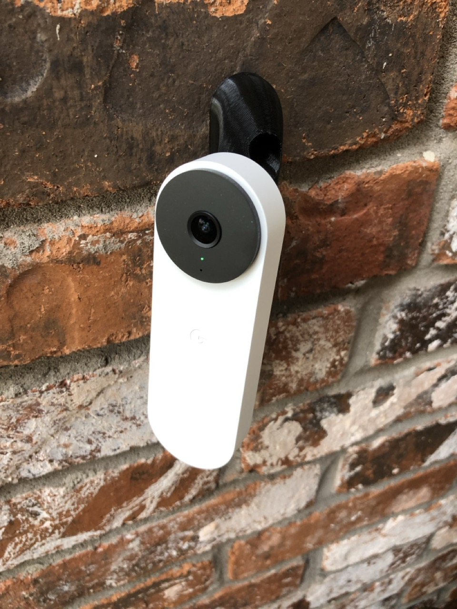

# Nest Doorbell Gen 3 Custom Wedge

This custom Nest Door wedge is designed for the latest Generation 3 model and
intended to mount on the left-hand surface when facing the door. The "yaw" angle
from the surface is 50° right, and 10° pitched-up. I recommend using at least a
1.5" Tapcon concrete anchors for the mounting hardware.

* [wedge_5_cura.3mf](./3mf/wedge_5_cura.3mf) is the main body
* [plug_top.3mf](./3mf/plug_top.3mf) is the plug for the top mount screw hole

